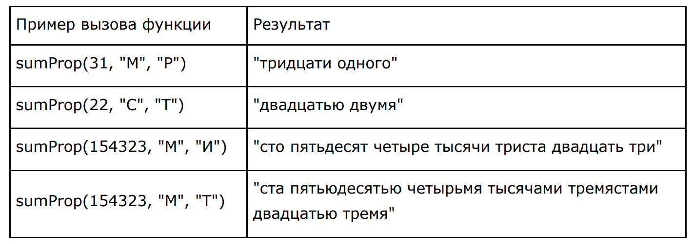

# Тестовое задание для программистов ИБС
I.	Напишите на своём любимом языке функцию преобразованию целого числа в строку прописью.
В любом падеже и в любом роде. Прототип функции:

`string sumProp(int nSum, string sGender, string sCase)`


nSum - целое число менее триллиона (максимум 999 999 999 999)

sGender - род ("М"-мужской, "Ж"-женский, "С"-средний)

sCase - падеж ("И"-именительный, …, "П"-предложный)



Версия python - 3.7.

1) Создание виртуального окружения:
```
python -m venv venv
```
2) Активация виртуального окружения:
```
# Для Windows
venv\Scripts\activate.bat
# Для Linux
source venv/bin/activate
```

3) Установка библиотек:
```
pip install -r requirements.txt
```

4) Запуск:
```
cd 1_task
python main.py
```

P.s. Тесты из примера проведены в файле tests_with_convert_num.py. Для их запуска необходимо папку task_1 
добавить в source с помощью оболочки Вашего ОС или IDE(mark directory as > sources root).

II. Спроектируйте схему базы данных, предназначенной для составления расписания занятий в ВУЗе. В общих чертах. Не нужно тщательно продумывать детали, например, длину строковых полей или способ представления адреса.
Изобразите таблицы в виде прямоугольников, связи между ними в виде стрелок, минимально необходимый набор полей. Возможно, какие-то жизненно важные индексы.
Снабдите неочевидные для понимания фрагменты схемы комментариями. Что и с какой целью создано, как предполагается использовать.
Типичный результат содержит 15-25 таблиц, размещается на 1-2 листах формата А4.

Ответ на задание в папке task_2 содержит:
1) Модель;
2) Описание модели;
3) DDL скрипт для создания модели.